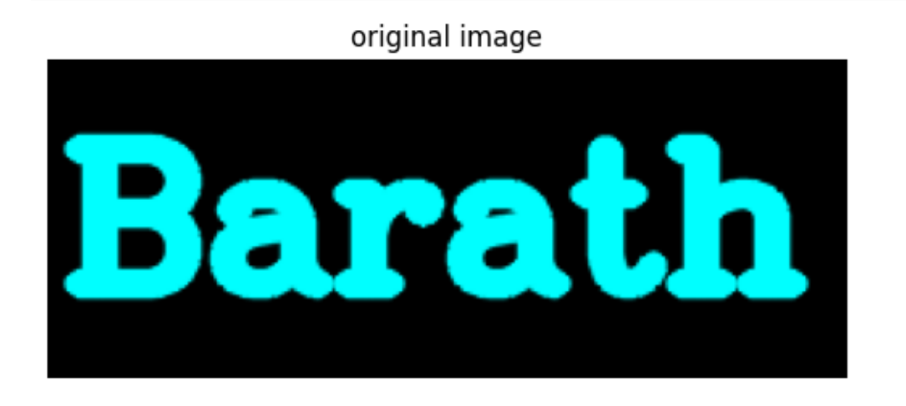
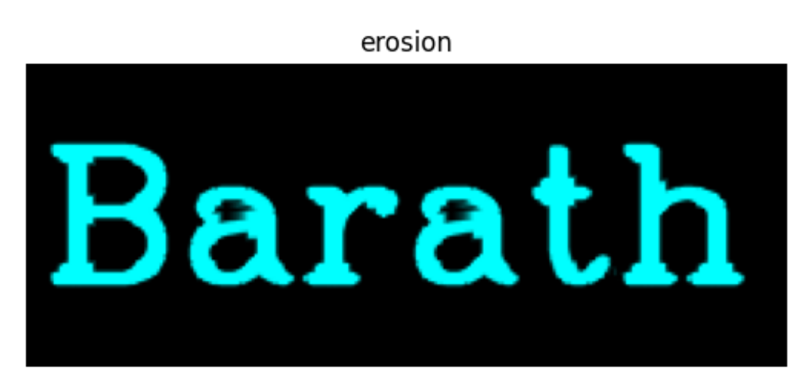
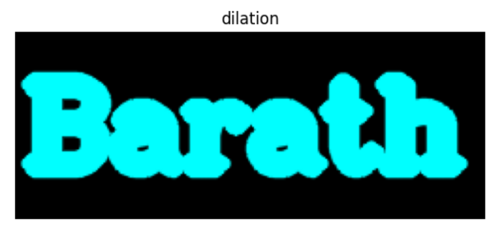

# Implementation-of-Erosion-and-Dilation
## Aim
To implement Erosion and Dilation using Python and OpenCV.
## Software Required
1. Anaconda - Python 3.7
2. OpenCV
## Algorithm:
### Step1:
Import the necessary packages.


### Step2:
Create the Text using cv2.putText.

### Step3:
Create the structuring element.

### Step4:
Erode and Dilate the image.
### Step5:
End Program.

 
## Program:

``` Python
import cv2
import matplotlib.pyplot as plt
import numpy as np

image1 = np.zeros((100,250), dtype = 'uint8')
image1 = cv2.cvtColor(image1,cv2.COLOR_BGR2RGB)
font = cv2.FONT_HERSHEY_COMPLEX = 3
cv2.putText(image1,'Barath',(5,70), font, 2, (0,255,255),7,cv2.LINE_AA)

plt.figure()
plt.imshow(image1)
plt.title("original image")
plt.axis("off")
plt.show()
                  
kernel = np.ones((5,5), np.uint8)
kernel1 = cv2.getStructuringElement(cv2.MORPH_CROSS,(6,6))
image_erode = cv2.erode(image1,kernel1)
image_dilation = cv2.dilate(image1, kernel1)

plt.figure()
plt.imshow(image_erode)
plt.title("erosion")
plt.axis("off")
plt.show()

plt.figure()
plt.imshow(image_dilation)
plt.title("dilation")
plt.axis("off")
plt.show()
```
## Output:

### Display the input Image


### Display the Eroded Image


### Display the Dilated Image


## Result
Thus the generated text image is eroded and dilated using python and OpenCV.